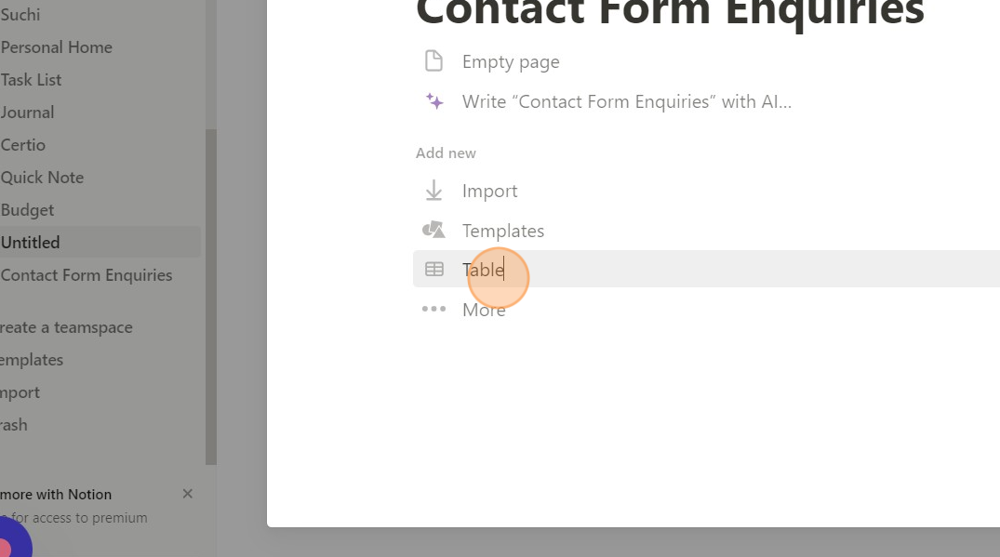

# 🔐 Creating env variables

### Introduction

The contact page on the website is connected to an edge function that requires three env variables - NOTION\_API\_KEY, NOTION\_DB\_ID, NOTION\_USER\_ID to store the contact enquiries and notify you about the enquiries.

Follow the steps below to create the env variables and then paste them in your deployment settings as described in the deployment documentation.

### Creating a Notion Account

1. Go to [https://notion.so](https://notion.so)
2. Create your account by clicking on Get Notion free.

***

### Creating NOTION\_API\_KEY env variable

1. Navigate to [https://developers.notion.com/](https://developers.notion.com/) and login with your notion account.
2.  Click “View my integrations”.

    <figure><figcaption></figcaption></figure>
3.  Click “New integration”

    <figure><figcaption></figcaption></figure>
4.  Give  the integration a name of your choice.

    <figure><figcaption></figcaption></figure>
5.  Click submit.&#x20;

    <figure><figcaption></figcaption></figure>
6.  Click “Capabilities”

    <figure><figcaption></figcaption></figure>
7.  Click “Read user information without email addresses”

    <figure><figcaption></figcaption></figure>
8.  Click “Save changes”

    <figure><figcaption></figcaption></figure>
9.  Go back to “Secrets”

    <figure><figcaption></figcaption></figure>
10. Click on “Show” and then “Copy”

    <figure><figcaption></figcaption></figure>
11. This secret is your NOTION\_API\_KEY value. Paste it in your deployment environment variables.

***

### Creating NOTION\_DB\_ID env variable

1. Go to [https://notion.so](https://notion.so) and login with your Notion account.
2.  Create a new page, with a table.

    <figure><figcaption>
Creating a new page
</figcaption></figure>

    <figure><figcaption>
Adding a table to the new page
</figcaption></figure>

3.  Create a new data source by entering the name and clicking on new database in the next page as shown below.

    <figure><figcaption></figcaption></figure>

4.  Change the heading of the 'Name' column to 'Subject'. This is the title column for the new pages.

           
5. Delete the Tags column.
6. Add the following new columns by clicking on the plus button.

<table data-full-width="false"><thead><tr><th>Property</th><th>Type</th></tr></thead><tbody><tr><td>Name</td><td>Text</td></tr><tr><td>Email</td><td>Email</td></tr><tr><td>Message</td><td>Text</td></tr><tr><td>Date</td><td>Date</td></tr><tr><td>Mention</td><td>Person</td></tr></tbody></table>

The final table should look similar to the below table.

<figure><figcaption>
Final Enquiries Table
</figcaption></figure>

7.  Click on more and then Add Connections → select the integration you created → Confirm. This step is mandatory to allow the integration to fill the data in the table.

    .png>).png>)
8.  Then open the table in a new view.

    .png>).png>)
9.  Copy the URL of the opened table. It should look as follows:

    https://www.notion.so/username/87e015e43e7f4c9ebb6fb9612f644556?v=\<VIEWID>
10. The ID after username/ and before ?v= is the NOTION\_DB\_ID. Paste it in your deployment environment variables.

***

### Creating NOTION\_USER\_ID env variable

1. Navigate to [https://reqbin.com/](https://reqbin.com/)
2. Paste `https://api.notion.com/v1/users` in the URL field.
3.  Go to Authorization tab and paste your [NOTION\_API\_KEY ](creating-env-variables.md#creating-notion\_api\_key-env-variable)in the Token field.

    <figure><figcaption></figcaption></figure>
4. Click on the Headers tab and paste `Notion-Version: 2022-06-28.`
5. Click Send.
6. Copy the ID of the user that **matches with your name, not the integration name. Verify that the type is person and not bot.**

<figure><figcaption></figcaption></figure>

7. This copied ID is your NOTION\_USER\_ID.
